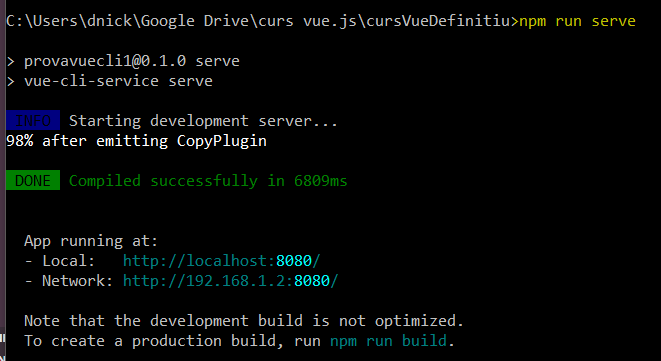

# Projecte curs Vue.js

Aquest projecte utilitza:

- **Vue (versió 2.6)**, un framework que ens ajuda a desenvolupar una aplicació web. Es tracta d'un framework reactiu. La interfaç canvia quan les dades de la pàgina canvien. Cada pàgina. Cada aplicació web està feta a partir de petits components que es poden reutilitzar en vàries pàgines.
- **Vue CLI **és una interfaç de comandes d'usuari per a executar comandes que ens ajudin a crear una estructura bàsica.

Opcionalment he utilitzat:

- **Bootstrap (4.6)**, un framework CSS que ens ajuda a desenvolupar aplicacions web responsive i adaptades a dispositius mòbils.

    "bootstrap": "^4.6.0",
    "bootstrap-vue": "^2.21.2",
    "core-js": "^3.6.5",
    "vue": "^2.6.12",
    "vue-cli": "^2.9.6",
    "vue-router": "^3.5.1",
    "vuex": "^3.6.2"

En primer lugar pots clonar aquest repositori amb:

        git clone http://github.com/danimrprofe/cursVueDefinitiu

Una vegada copiat el repositori en l'ordinador, falta instal·lar i arrencar el servidor per poder veure el funcionament.

## Setup del projecte

El primer pas és instal·lar tot el necessari. Els mòduls no estan inclosos al repositori per estalviar espai.

```
npm install
```

Veurem que tardarà una estona en descarregar-los tots.


En acabar ens informarà de tots els paquets instal·lats, i si hi ha cap vulnerabilitat.


Ara ja tenim tots els arxius necessaris per arrencar l'aplicació.


### Compilar i recarregar

Per arrencar el servidor:

```
npm run serve
```

Ens obrirà un server al port 8080 de la nostra màquina, al qual hi accedirem des del navegador



### Sandboxing

Aquest repositori està enllaçat amb la web codesandbox, que agafa el repositori i el desplega per a poder provar-lo. 

Aquest enllaç agafa la darrera versió de l'aplicació des de GitHub.

https://codesandbox.io/s/github/danimrprofe/cursVueDefinitiu

### Compiles and minifies for production

Si volguessim afinar per a penjar en producció:

```
npm run build
```

He provat a veure com funciona això, i es veu que genera una carpeta **dist**, i empaqueta l'aplicació per a que ocupi menys. De pas, te mostra uns **warnings** amb recomanacions per optimitzar el rendiment.


Mirant un poc, es veu que te fa un html, una carpeta CSS y un altra per javascript.


### Lints and fixes files
```
npm run lint
```

He provat i no m'ha donat cap error:


### Customize configuration
See [Configuration Reference](https://cli.vuejs.org/config/).
